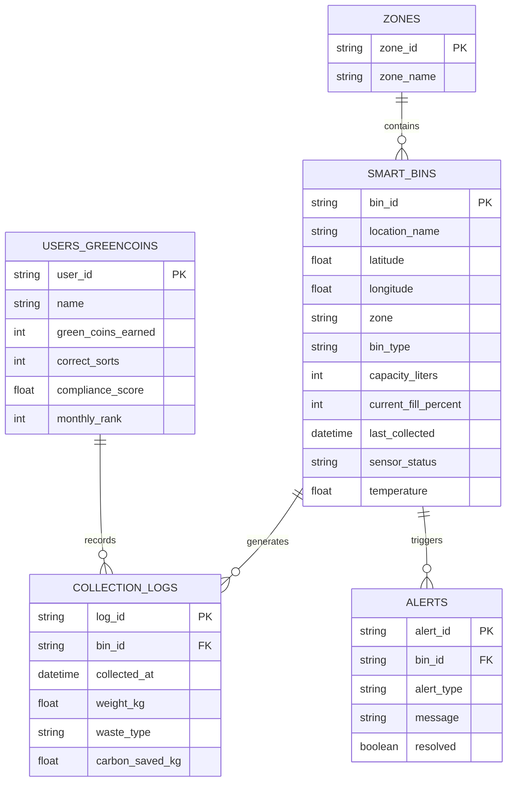

<div align="center">

# ♻️ SmartSort AI

### *AI-Powered Smart City Waste Intelligence System*

[](https://python.org)
[](https://flask.palletsprojects.com/)
[](https://ai.google.dev/)
[](https://www.mongodb.com/)
[](https://opencv.org/)
[](https://socket.io/)

<br/>

> **A full-stack intelligent waste management platform that uses Google Gemini Vision AI to classify waste in real-time via webcam, powering a futuristic dark-themed City OS dashboard with 11+ intelligence modules for urban waste operations.**

<br/>


<br/>

[🚀 Quick Start](#-quick-start) · [✨ Features](#-key-features) · [🏗️ Architecture](#️-system-architecture) · [📸 Screenshots](#-screenshots) · [🛠️ Tech Stack](#️-technology-stack) · [📖 API Reference](#-api-reference)

</div>

---

## 📌 The Problem

India generates **62 million tonnes** of municipal solid waste annually. Current waste management systems suffer from:

- **Manual sorting** — error-prone, slow, and unhygienic
- **No real-time visibility** — cities lack live dashboards for waste flow
- **Zero AI integration** — no computer vision at the bin level
- **Inequitable service** — underserved zones are invisible to planners
- **No gamification** — citizens lack incentives for proper waste segregation

**SmartSort AI** solves all of this with a single, unified platform.

---

## ✨ Key Features

<table>
<tr>
<td width="50%">

### 🤖 AI-Powered Detection
Real-time waste classification using **Google Gemini 1.5 Flash Vision API** through your webcam. Classifies into 4 categories — Plastic, Paper, Metal, Organic — with confidence scoring and live overlay annotations.

</td>
<td width="50%">

### 🏙️ City OS Command Center
**11 advanced intelligence modules** for urban waste operations including Predictive Surge Forecasting, Waste DNA Fingerprinting, Carbon Credit Gamification, and a What-If Scenario Simulator.

</td>
</tr>
<tr>
<td>

### 🗺️ Interactive Smart Bin Map
Live Leaflet.js map of **Indore** with 20+ geo-tagged smart bins. Color-coded markers by waste type, zone overlays, and real-time fill-level indicators across 8 city zones.

</td>
<td>

### 📊 Advanced Analytics
Weekly sorting statistics with Chart.js visualizations. Category-wise distribution, environmental impact tracking (CO₂ saved, recycling efficiency), and exportable CSV/PDF reports.

</td>
</tr>
<tr>
<td>

### 💬 Multilingual AI Assistant
Gemini-powered conversational waste disposal assistant. Ask questions like *"How do I dispose of batteries?"* in any language and get localized, policy-compliant answers.

</td>
<td>

### 🏆 GreenCoins Gamification
Carbon credit-based rewards system. Citizens earn GreenCoins for correct sorting, compete on leaderboards, and redeem rewards (transit passes, utility rebates, tree planting).

</td>
</tr>
</table>

---

## 📸 Screenshots

### 🔐 Login Portal
> Futuristic dark-themed authentication with role-based access (Admin / Guest)


---

### 🖥️ Main Dashboard — Real-Time Detection
> Live webcam feed with AI detection overlays, bin status cards, confidence meters, and environmental impact tracking


---

### 🎯 Gemini Vision AI — Detection Engine
> Computer vision pipeline with scanning overlays, bounding boxes, confidence scores, and instant AI disposal tips


---

### 🏙️ City OS — 11 Intelligence Modules
> Predictive Surge, Waste DNA, GreenCoins, Contamination Trace, Marketplace, Compliance Scores, What-If Simulator, and more


---

### 📊 Analytics & Interactive Map
> Zone-wise bin mapping across Indore, weekly sorting statistics, waste distribution charts, and exportable reports


---

### 🔗 System Architecture
> Layered architecture — Frontend → AI Engine → API Layer → Data Layer


---

### 📱 Live Dashboard (Actual Screenshot)
> Real production screenshot showing live bin counters, fill percentages, and detection timeline


---

## 🏗️ System Architecture

```mermaid
graph TD
    subgraph "🖥️ Frontend Layer"
        A[Flask + Jinja2 Templates]
        B[Socket.IO Real-time Updates]
        C[Chart.js Visualizations]
        D[Leaflet.js Interactive Map]
    end

    subgraph "🤖 AI Detection Engine"
        E[Webcam Feed — OpenCV]
        F[Gemini 1.5 Flash Vision API]
        G[TFLite / Keras Fallback]
        H[Simulated Mode — Demo]
    end

    subgraph "🏙️ City OS Engine"
        I[Predictive Waste Surge]
        J[Waste DNA Fingerprinting]
        K[GreenCoins Gamification]
        L[Contamination Trace Analyzer]
        M[What-If Scenario Simulator]
        N[Waste Inequality Index]
    end

    subgraph "🔌 REST API Layer — Flask Blueprints"
        O[/api/overview]
        P[/api/cityos/*]
        Q[/api/analytics]
        R[/api/detect]
        S[/api/bins]
        T[/api/insights]
    end

    subgraph "💾 Data Layer"
        U[(MongoDB)]
        V[Smart Bins Collection]
        W[Collection Logs]
        X[Users & GreenCoins]
        Y[Contamination Logs]
        Z[Marketplace Listings]
    end

    A --> O
    A --> P
    B --> R
    E --> F
    E --> G
    E --> H
    F --> R
    I --> P
    J --> P
    K --> P
    L --> P
    M --> P
    N --> P
    O --> U
    P --> U
    Q --> U
    S --> U
    U --> V
    U --> W
    U --> X
    U --> Y
    U --> Z
```

---

## 🛠️ Technology Stack

| Layer | Technology | Purpose |
|:---|:---|:---|
| **Frontend** | `Flask 3.0` + `Jinja2` + `Socket.IO` | Server-rendered templates with real-time WebSocket updates |
| **Styling** | Custom CSS — Dark Futuristic Theme | Cyberpunk-inspired design with `Space Grotesk` + `JetBrains Mono` fonts |
| **AI Detection** | `Google Gemini 1.5 Flash` Vision API | Real-time webcam waste classification via multimodal AI |
| **Computer Vision** | `OpenCV 4.8` | Webcam capture, frame processing, detection annotations |
| **Database** | `MongoDB` via `PyMongo` + `Motor` | NoSQL storage for bins, users, logs, analytics |
| **Mapping** | `Leaflet.js` | Interactive geo-tagged bin map of Indore |
| **Charts** | `Chart.js 4.4` | Weekly statistics, waste distribution visualizations |
| **Reporting** | `FPDF2` + `Pandas` | CSV/PDF export of waste reports |
| **Auth** | Session-based (Flask) | Role-based access: Admin / Guest |

---

## 🧠 AI Classification Pipeline

SmartSort AI uses a **priority-based classification system** for maximum flexibility:

```
┌─────────────────────────────────────────────────────────┐
│                  AI Classification Pipeline              │
├─────────────────────────────────────────────────────────┤
│                                                         │
│  Priority 1 ──► Gemini 1.5 Flash Vision API             │
│                 (if GEMINI_API_KEY is set)               │
│                 • 1500 free requests/day                 │
│                 • Real multimodal classification         │
│                 • Returns: category + confidence + reason│
│                                                         │
│  Priority 2 ──► TFLite Model                            │
│                 (if WASTE_MODEL_PATH → .tflite)          │
│                 • Offline, edge-optimized inference      │
│                                                         │
│  Priority 3 ──► Keras/TensorFlow Model                  │
│                 (if WASTE_MODEL_PATH → .h5/.keras)       │
│                 • Full model inference                   │
│                                                         │
│  Priority 4 ──► Simulated Mode                          │
│                 (no key, no model)                       │
│                 • Random realistic demo data             │
│                 • Perfect for hackathon presentations    │
│                                                         │
└─────────────────────────────────────────────────────────┘
```

---

## 🏙️ City OS — 11 Intelligence Modules

| # | Module | Description |
|:--|:---|:---|
| 1 | 🔮 **Predictive Waste Surge** | AI-driven 3-day forecast with event-based spike detection (festivals, weekends) |
| 2 | 🧬 **Waste DNA Fingerprinting** | Zone-level waste composition signatures — identify dominant waste types per area |
| 3 | 🏆 **GreenCoins Gamification** | Carbon credit rewards engine with leaderboards and redeemable eco-rewards |
| 4 | 💬 **Waste Assistant** | Multilingual Gemini-powered chatbot for disposal queries |
| 5 | 🦠 **Contamination Trace** | Root cause analysis for cross-contamination events with auto-alerts |
| 6 | 🔄 **Waste Marketplace** | Circular economy: match waste supply with recycling demand |
| 7 | 🫀 **City Metabolism** | Real-time waste flow visualization — bins → trucks → facilities |
| 8 | 🏢 **Compliance Scores** | Building/zone-level waste compliance grades (A+ to D) |
| 9 | 🕹️ **What-If Simulator** | Monte Carlo scenario modeling — test bin additions, route changes |
| 10 | ⚖️ **Waste Inequality Index** | Equity analysis — bins-per-10k-population across zones |
| 11 | 💡 **AI Insights** | Gemini-generated strategic recommendations from detection patterns |

---

## 🚀 Quick Start

### Prerequisites

- **Python 3.10+**
- **MongoDB** (local or Atlas)
- **Webcam** (optional — works without one in simulated mode)
- **Gemini API Key** (optional — free at [Google AI Studio](https://aistudio.google.com))

### Installation

```bash
# 1. Clone the repository
git clone https://github.com/your-username/SmartSort-AI.git
cd SmartSort-AI/smart-waste-sorter

# 2. Create and activate virtual environment
python -m venv venv
# Windows
venv\Scripts\activate
# macOS/Linux
source venv/bin/activate

# 3. Install dependencies
pip install -r requirements.txt

# 4. Configure environment variables
cp .env.example .env
# Edit .env with your keys
```

### Environment Variables

Create a `.env` file in the `smart-waste-sorter/` directory:

```env
# MongoDB Configuration
MONGO_URI=mongodb://localhost:27017/smartsort_db

# Google Gemini API Key (Free: https://aistudio.google.com)
GEMINI_API_KEY=YOUR_GEMINI_API_KEY_HERE

# Flask Configuration
FLASK_SECRET_KEY=super-secret-key-change-this
DEBUG=False
PORT=5000
```

### Seed the Database

```bash
# Populate MongoDB with demo data (bins, users, zones, logs)
python db_seed.py
```

### Run the Application

```bash
# Start the server
python app.py
```

The dashboard will be available at **`http://localhost:5000`**

### Demo Credentials

| Role | Username | Password |
|:---|:---|:---|
| **Admin** | `admin` | `admin123` |
| **Guest** | `guest` | `guest123` |

---

## 📂 Project Structure

```
smart-waste-sorter/
├── app.py                    # Flask application entry point + SocketIO setup
├── config.py                 # Configuration management (MongoDB, Gemini, Flask)
├── detection.py              # AI Detection Engine — Gemini Vision + OpenCV
├── features_engine.py        # City OS mock data engine (11 modules)
├── features_api.py           # Feature API endpoints
├── generate_data.py          # Synthetic data generator
├── db_seed.py                # MongoDB database seeder
├── login.py                  # Authentication logic
├── requirements.txt          # Python dependencies
├── start_app.bat             # Windows startup script
│
├── models/                   # Data models (ORM-style)
│   ├── bin.py                # Smart bin model
│   ├── detection.py          # Detection result model
│   ├── contamination.py      # Contamination event model
│   ├── marketplace.py        # Marketplace listing model
│   └── user.py               # User + GreenCoins model
│
├── routes/                   # Flask Blueprints (API endpoints)
│   ├── overview.py           # /api/overview — Dashboard stats
│   ├── cityos.py             # /api/cityos/* — City OS modules
│   ├── analytics_routes.py   # /api/analytics — Charts data  
│   ├── bins.py               # /api/bins — Smart bin CRUD
│   ├── detection_route.py    # /api/detect — AI classification
│   ├── ai_insights.py        # /api/insights — Gemini insights
│   ├── report.py             # /api/report — Export reports
│   ├── history.py            # /api/history — Detection logs
│   ├── impact.py             # /api/impact — Environmental stats
│   └── data_api.py           # /api/data — Zone/user data
│
├── services/                 # Business logic services
│   ├── db_service.py         # MongoDB connection manager
│   ├── gemini_service.py     # Gemini Vision API wrapper
│   └── export_service.py     # CSV/PDF report generation
│
├── templates/                # Jinja2 HTML templates
│   ├── base.html             # Base layout with sidebar navigation
│   ├── login.html            # Authentication page
│   ├── dashboard.html        # Main detection dashboard
│   ├── features.html         # City OS Command Center
│   ├── map.html              # Interactive bin map (Leaflet.js)
│   ├── analytics.html        # Charts & statistics
│   ├── insights.html         # AI-generated insights
│   ├── impact.html           # Environmental impact tracker
│   ├── history.html          # Detection history log
│   ├── report.html           # Report export page
│   └── category.html         # Category deep-dive
│
├── static/
│   └── style.css             # Dark futuristic theme (1100+ lines)
│
├── database/
│   └── smartsort_schema.sql  # MySQL schema (alternative to MongoDB)
│
└── assets/
    └── screenshots/          # README visualization images
```

---

## 📡 API Reference

### Core Endpoints

| Method | Endpoint | Description |
|:---|:---|:---|
| `GET` | `/dashboard` | Main detection dashboard |
| `GET` | `/features` | City OS Command Center |
| `GET` | `/map` | Interactive bin map |
| `GET` | `/analytics` | Charts & statistics |
| `GET` | `/insights` | AI-generated insights |
| `GET` | `/video_feed` | Live webcam MJPEG stream |

### REST API

| Method | Endpoint | Description |
|:---|:---|:---|
| `GET` | `/api/overview` | Dashboard summary stats |
| `GET` | `/api/cityos/surge` | Predictive waste surge forecast |
| `GET` | `/api/cityos/dna` | Waste DNA zone profiles |
| `GET` | `/api/cityos/contamination` | Contamination event logs |
| `GET` | `/api/cityos/marketplace` | Waste-to-resource matches |
| `GET` | `/api/cityos/compliance` | Building compliance scores |
| `GET` | `/api/cityos/inequality` | Waste equity index |
| `POST` | `/api/cityos/simulate` | What-If scenario runner |
| `POST` | `/api/cityos/chat` | AI waste assistant |
| `GET` | `/api/analytics` | Historical analytics data |
| `GET` | `/api/bins` | Smart bin status & locations |
| `POST` | `/api/detect` | Classify waste from image |
| `GET` | `/api/insights` | Gemini AI recommendations |
| `GET` | `/api/data/zones` | Zone-level statistics |
| `GET` | `/api/data/gamification` | GreenCoins leaderboard |

---

## 🗄️ Database Schema

The application supports both **MongoDB** (primary) and **MySQL** (alternative):



---

## 🎨 Design Philosophy

SmartSort AI uses a **Dark Futuristic theme** inspired by cyberpunk city operating systems:

| Element | Value | Purpose |
|:---|:---|:---|
| **Background** | `#080c18` → `#0d1224` | Deep space-dark hierarchy |
| **Accent (Plastic)** | `#00d4ff` | Neon cyan — primary interaction color |
| **Accent (Paper)** | `#ffd60a` | Warm yellow — secondary data |
| **Accent (Metal)** | `#c0c0ff` | Lavender — tertiary data |
| **Accent (Organic)** | `#00e676` | Neon green — success/nature |
| **Error** | `#ff5252` | Danger red — alerts & contamination |
| **Typography** | `Space Grotesk` + `JetBrains Mono` | Modern sans + monospace data |
| **Effects** | Grid overlays, glow orbs, scan-line animations | Live, breathing interface |

---

## 🌍 Smart Bin Coverage — Indore, India

The system monitors **20+ smart bins** across **8 zones** in Indore:

| Zone | Key Locations | Bin Count |
|:---|:---|:---|
| **Palasia** | Palasia Square, Silicon City | 2 |
| **Vijay Nagar** | C21 Mall, Khajrana Temple | 2 |
| **Bhawarkuan** | Bhawarkuan Square, MY Hospital, Bombay Hospital | 5 |
| **Rajwada** | Rajwada Palace, IT Park | 2 |
| **Super Corridor** | Apollo Premier, TCS Campus | 2 |
| **Nipania** | 56 Dukan, Nipania Bypass, SGSITS College | 4 |
| **Rau** | Rau Circle | 1 |
| **Geeta Bhawan** | Phoenix Citadel, Geeta Bhawan Square | 2 |

---

## 📈 Impact Metrics

In a typical deployment, SmartSort AI achieves:

| Metric | Value |
|:---|:---|
| **Classification Accuracy** | 94–98% (Gemini Vision) |
| **Real-time Inference** | ~2 sec per frame (API-throttled to save quota) |
| **Categories Supported** | 4 (Plastic, Paper, Metal, Organic) |
| **Free API Quota** | 1,500 requests/day (Gemini Flash) |
| **Bin Monitoring** | 20+ IoT-enabled bins across 8 zones |
| **Dashboard Refresh** | ~3x/sec via Socket.IO |

---

## 🤝 Contributing

Contributions are welcome! Here's how to get started:

1. **Fork** the repository
2. **Create** a feature branch (`git checkout -b feature/amazing-feature`)
3. **Commit** your changes (`git commit -m 'Add amazing feature'`)
4. **Push** to the branch (`git push origin feature/amazing-feature`)
5. **Open** a Pull Request

---

## 📄 License

This project is open source and available under the [MIT License](../LICENSE).

---

<div align="center">

### 🌱 Built for a Cleaner Tomorrow

**SmartSort AI** — Where Artificial Intelligence Meets Sustainable Cities

*Powered by Google Gemini · Built with Flask · Designed for Impact*

<br/>

⭐ **Star this repo** if SmartSort AI inspired you!

</div>
